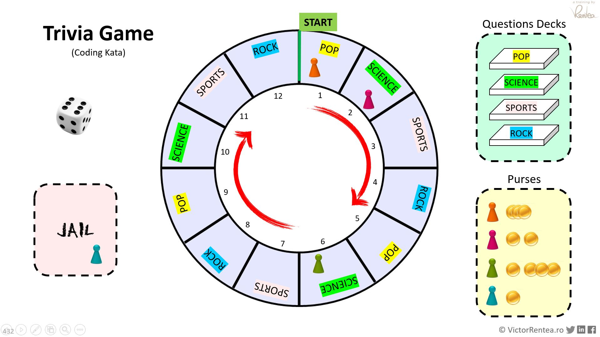

# Kata de Refactoring Trivia  
(Juste l'un des nombreux katas de code sur [kata-log.rocks](https://kata-log.rocks/))

## Le problème  
Voici un aperçu d'un jeu en action.  
  
À chaque tour, un joueur : lance le dé et doit répondre à une question du paquet correspondant à sa position actuelle. Si la réponse est correcte, il/elle gagne des pièces. Si elle est incorrecte, il/elle est envoyé(e) en prison. Le plateau comporte 12 positions.

Vous devez découvrir les détails en consultant le code réel, comme dans la vie de tous les jours. Bonne chance !

## Que les tests commencent !  
Il était une fois une implémentation (très) laide du Trivia Game.

Quelqu'un remarqua qu'à condition de fournir les mêmes entrées au système,  
il affichera toujours la même sortie sur la console. Ce gars eut alors l'idée de  
copier-coller l'ancienne implémentation (dans `Game.java`), et d'écrire un test  
qui, en utilisant BEAUCOUP d'entrées aléatoires, appellerait à la fois l'ancien système et le NOUVEAU système avec les mêmes entrées.  
De très, très nombreuses fois. Genre 10 000 fois. Puis, le test vérifierait simplement que la sortie console  
restait identique malgré toute nos refactorisations.

C'est ce qu'on appelle la "Golden Master Method", et c'est elle qui a servi à construire `GameTest`.

## La tâche  
Votre mission est de refactoriser `Game.java`, en exécutant continuellement `GameTest` pour vous assurer que vous ne cassez rien.

⚠️ Essayez d'éviter le sur-engineering : Keep-it short and simple (Principe KISS 💋), même si à la base, c'était "Keep it simple, stupid", mais que ça ne parraissait pas politiquement correct.

**Ne touchez pas à `GameOld.java`** sauf pour corriger un bug.

Objectif : appliquer les principes de la programmation orientée objet, identifier les responsabilités (principe SRP), éliminer les duplications (principe DRY) et adopter d'autres bonnes pratiques logicielles !

Avertissements :  
- Certains noms sont trompeurs.  
- Il manque des abstractions (classes).  
- Une faute de frappe et un bug y sont cachés. Pouvez-vous les trouver ? Si oui, corrigez-les également dans l'ancien code (`GameOld.java`).

Faites de votre mieux jusqu'à ce que vous soyez *fier* de ce code !

## Temps de travail estimé : 2-4 heures  
Pour une meilleure expérience :  
- Travaillez idéalement en programmation en binôme  
- Vous aurez besoin d'au moins 3-4 passages à travers le code  
- Relisez chaque classe jusqu'à ce qu'il n'y ait **plus rien** à améliorer (oui, je peux passer poser des questions, alors te pose pas de question, si t'as un doute, c'est que tu peux mieux faire).

## Technique  
- Essayez d'utiliser autant de corrections rapides que possible : Alt-Enter/⌥Enter (IntelliJ) ou Ctrl-1 (Eclipse)  
- Utilisez autant que possible le refactoring automatique de votre IDE  
- Travaillez par petites étapes, en exécutant continuellement les tests  
- Commitez fréquemment pour pouvoir revenir en arrière en cas d'erreur ou de mauvaise direction  
- N'ayez jamais peur de revenir en arrière et d'explorer une autre idée de design

***
Pour chaque membre du binôme:

Faîtes chacun un très joli commit, nommé Trivia - Refactored! nom1 =, nom2

Oui, l'un de vous deux aura un commit avec tout le code... Est-ce que c'est grave ?  

Si tu as répondu a cette uestion toi même, JE SUIS LE SEUL JUGE, OK ? :P
***

## Suite - Votre binôme prend fin ici :/ Désolé

Une fois que vous êtes fier de la forme que vous avez donnée au code, essayez ce qui suit :

### Implémenter quelques changements  
Essayez de mettre en œuvre certaines des demandes de changement suivantes :  
- Le nombre maximum de joueurs doit être porté à 6  
- Ajouter une nouvelle catégorie de questions « Géographie »  
- Il doit y avoir au moins 2 joueurs pour démarrer la partie  
- La partie ne doit pas commencer tant que tous les joueurs n'ont pas été ajoutés. En d'autres termes, de nouveaux joueurs ne peuvent pas rejoindre après le début du jeu.  
- Aucun deux joueurs ne peuvent avoir le même nom.  
- [difficile] Après une réponse incorrecte, un joueur ne va en prison que s'il échoue à répondre à une deuxième question dans la même catégorie. Autrement dit, il/elle se voit offrir une « seconde chance » dans la même catégorie.  
- [difficile] Charger les questions à partir de 4 fichiers de propriétés : `rock.properties`, `sports.properties`, ...  
- [difficile] Une série (streak) est une séquence consécutive de réponses correctes pour un joueur donné. Après avoir donné 3 réponses correctes consécutives, un joueur gagne 2 points pour chaque réponse correcte suivante. Lorsqu'un joueur donne une réponse incorrecte : (a) s'il/elle était en série, la série se termine OU (b) s'il n'y avait pas de série, le joueur va en prison. (En d'autres termes, avec une série active, un joueur ne va pas en prison, mais perd sa série). De plus, la partie doit être remportée avec un double de points.

Combien était-il difficile d'implémenter ces changements ?

### Écrire des tests unitaires  
Alternativement, essayez d'écrire plusieurs tests unitaires précis sur le comportement du jeu. Ce n'est pas plus facile à faire après avoir refactorisé le code, n'est-ce pas ? Refactoring = Compréhension approfondie.

Indice : vous êtes autorisé à exposer les informations des joueurs hors du jeu.